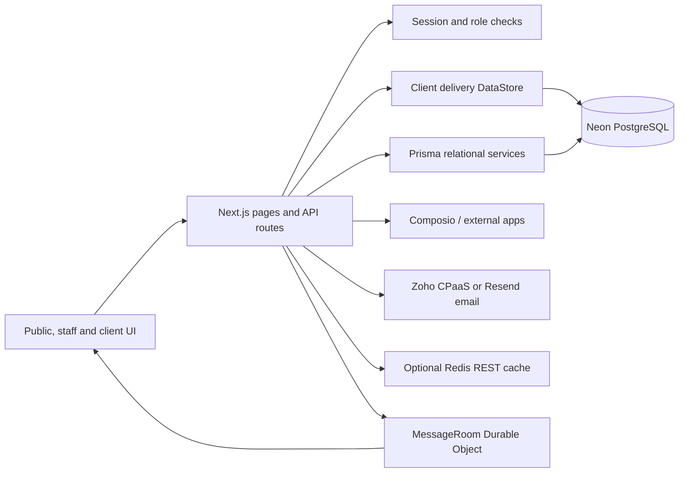

# Boatship architecture

Last reviewed: 2026-09-25. Baseline: `dd47da8` plus the current working tree.

This folder is the entry point for understanding and changing Boatship. It describes the implementation visible in this repository; it is not a claim that every optional integration is configured or deployed. Read the source files linked below for exact behavior.

## Read in this order

1. [system.md](system.md) — runtime, data, authentication, request flow, and deployment.
2. [features.md](features.md) — what each user-facing and integration area does, with entry points.
3. [status.md](status.md) — completed work, known boundaries, current working tree, and decisions still open.
4. [enterprise-readiness-audit.md](enterprise-readiness-audit.md) — prioritized minimum controls for wider company use and current gaps.

Existing focused references: [Git integration](../docs/git-integration.md), [MCP clients](../docs/mcp-clients.md), [product integration plan](../docs/products-saas-integration-plan.md), [hosted secrets](../docs/cloudflare-secrets.md), [product principles](../PRODUCT.md), and [design record](../DESIGN.md).

Operational references: [runbooks](../docs/operations/README.md) for first admin, releases, restore, and incidents; [dependency advisory triage](../docs/dependency-audit.md).

## At a glance

Boatship is a Next.js 16 App Router application with a public marketing home, a staff application, and a client portal. Staff manage onboarding and delivery for clients; clients complete assigned work and communicate in their own workspace. Staff also manage company products separately from client projects. Hodi provides staff assistance and controlled action proposals.

## Repository map

| Path | Responsibility |
| --- | --- |
| `app/page.tsx`, `app/login/` | Public home and sign-in. |
| `app/(admin)/` | Staff pages under URLs such as `/dashboard`, `/clients`, `/products`, and `/hodi`. |
| `app/(client)/portal/` | Client-only pages under `/portal`. |
| `app/api/` | HTTP endpoints; routes authenticate and authorize before calling domain services. |
| `components/admin/`, `components/client/`, `components/shared/`, `components/hodi/` | Application shells, shared work UI, messaging, and Hodi UI. |
| `lib/store.ts`, `types/index.ts` | Client delivery domain and its persistence interface. |
| `lib/products.ts`, `types/product.ts` | Product validation, membership, work, and release helpers. |
| `lib/auth.ts`, `lib/session.ts`, `lib/rbac.ts`, `proxy.ts` | Sessions, roles, permissions, and route-level redirects. |
| `lib/hodi-*.ts`, `lib/agent.ts`, `lib/boatship-rag.ts` | Agent context, queue, proposals, communications, and automation reviews. |
| `lib/git-*.ts`, `lib/mcp-*.ts` | Repository evidence, validation, MCP identity and tools. |
| `prisma/schema.prisma`, `prisma/migrations/`, `generated/prisma/` | Database schema, migrations, generated client. |
| `custom-worker.ts`, `lib/realtime/`, `wrangler*.toml` | Cloudflare Worker and live message room. |
| `scripts/` | Database migration/import, user provisioning, and Cloudflare build helpers. |
| `public/reference-home-static/` | Imported marketing reference assets and static material; avoid treating its older customer claims as verified Boatship claims. |

## How to maintain this folder

For each material change, update the affected section here in the same change: describe the new behavior, source of truth, affected routes, permissions, deployment or migration needs, and limitations. Update `status.md` when a planned item becomes implemented or a boundary changes. Keep historical milestones short and factual. Do not copy secrets, private customer data, or generated files into these docs. The persistent instruction in `AGENTS.md` asks future agents to do this.
