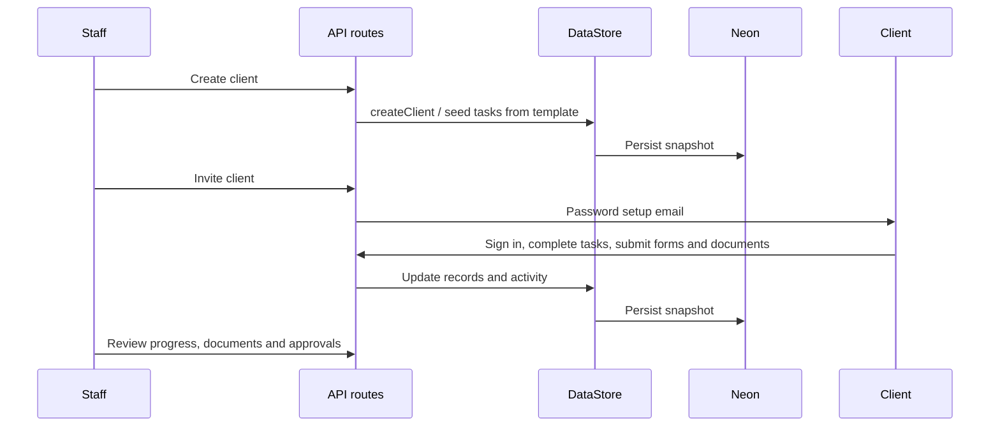

# System design and request flow

Last reviewed: 2026-09-25.

## Runtime and entry points

- Next.js `16.3.4`, React 19, TypeScript, Tailwind CSS. Pages use the App Router. Staff and portal route groups have separate shell components; their group names do not appear in URLs.
- `proxy.ts` handles coarse browser routing: the public home stays accessible; unauthenticated protected page visits go to `/login`; client and staff pages redirect to the correct home. API routes do their own database-backed session and permission checks. The proxy's decoded token payload is not the final authorization decision.
- `app/api/**/route.ts` contains HTTP handlers. `lib/api.ts` standardizes success/error responses. Most handlers declare the Node.js runtime; the Cloudflare adapter packages them for Workers.
- `app/layout.tsx`, `app/globals.css`, the two route-group layouts, and `components/*Shell.tsx` define the global UI frame. `components/shared/AuthProvider.tsx` manages browser auth state.

## Persistence

**Primary database:** Neon PostgreSQL through Prisma (`lib/prisma.ts`). `DATABASE_URL` uses the Neon HTTP adapter by default. An optional real Cloudflare Hyperdrive binding switches to Prisma's PostgreSQL adapter. `DIRECT_URL` is used by Prisma schema and migrations. Prisma clients are constructed per call for Worker request isolation.

**Client delivery store:** `lib/store.ts` exposes `DataStore`. Clients, tasks, templates, documents, form templates and submissions, activity, comments, messages, webhooks, smart lists, agent chat history, vessels, integration runs, and project operations are typed arrays or feature data in a `StoreSnapshot` JSON record. `PrismaStore` reads a fresh snapshot before each mutation and conditionally updates its version, retrying conflicting writes. Successful writes refresh its Worker-local cache and advance the optional Redis cache generation. Reads may still briefly be stale across isolates. The `LocalStore` file at `.data/store.json` is available only when `ALLOW_LOCAL_STORE=1`, for demo work. `types/index.ts` defines the domain shapes. Existing snapshots are normalized when loaded; fixed demo users are seeded only in local development mode.

**Relational tables:** `AuthSession`, `UserProfile`, and `NotificationRecord` support hot identity and notification reads. `RateLimitBucket` stores shared request quotas; `StoreSnapshot.version` supports conditional writes. Separate relational models hold provider credentials and connection ownership, MCP identities/access/audit, Git repositories and evidence, task approvals, Hodi queue/proposals/automation state and runs, and products/members/milestones/work/releases/activity. See `prisma/schema.prisma` for exact columns and relations. The September 2026 migrations progressively introduced these models, including product tables in `20260924000000_add_products` and the two migrations immediately after it.

**Optional cache:** `lib/redis-cache.ts` uses Upstash-compatible Redis REST for selected read endpoints. It is best effort and keyed by a generation advanced after datastore writes. Redis failure falls back to Neon. Do not assume it invalidates independent relational product writes; those queries have their own behavior.

**Documents:** `app/api/documents/upload-url` returns a client-scoped database storage path; `app/api/documents/upload` validates file type and a 10 MB limit, then stores base64 content and document metadata through `DataStore`. Version history is kept on reupload. The `db://` path is a logical key, not an object-storage bucket. Review and retrieval live in the document routes.

## Identity and authorization

1. `POST /api/auth/login` verifies a stored scrypt password hash and creates a random session token. A hash of the token, user ID, and expiry are stored in `AuthSession`. The browser receives an HTTP-only cookie; bearer tokens are also accepted by API session resolution.
2. `lib/auth.ts` verifies the token against the database, checks expiry, reloads the current user, and rejects users required to reset their password or still using known fixed demo credentials in production. `proxy.ts` supplies page redirects based on the token's embedded routing hint and rejects cross-origin cookie-authenticated API mutations. API routes remain responsible for authorization.
3. API handlers use `requireSession` / `requireRoles`, `lib/rbac.ts` staff permissions, and server-only `lib/client-access.ts` for client ownership/assignment checks. Team members are restricted to clients currently assigned to them; this is enforced on core client resources and aggregate paths such as analytics, exports, reminders, calendar, Hodi, and MCP context. The helper reads the current committed assignment for team authorization rather than trusting a Worker-local snapshot cache. Client users remain scoped to their own `clientId`; product routes use explicit product membership and write roles from `lib/products.ts`.
4. Invitations and password resets use one-time setup/reset links and `lib/email.ts` / Resend. Delivery requires valid Resend configuration. User and account management endpoints are under `/api/users`, `/api/clients/*/invite`, and `/api/account`.
5. User-entered provider secrets are encrypted by `lib/user-secrets.ts` before persistence. `BOATSHIP_SECRETS_MASTER_KEY` must be retained for decryption. MCP tokens are shown once and stored hashed; MCP scopes and project access are verified separately.
6. Login, password reset, invitation, MCP, and agent chat requests consume shared database rate limits in `lib/rate-limit.ts`. Explicit local-only demo mode uses process-local buckets so it can run without a database. Outbound webhooks require a configured exact HTTPS origin in `WEBHOOK_ALLOWED_ORIGINS`; redirects are rejected and list/detail responses redact signing secrets.

## Typical client delivery flow

Task work may carry subtasks, dependencies, comments, evidence, definition-of-done, Git links, validation, and manager approval. Client project operations add milestones, schedules, and approvals through `lib/project-operations.ts`. Notifications and activity connect changes back to staff and clients.

## Live messages

`/api/messages` is the persisted source of truth. After a message is saved, the route publishes it to a client-specific `MessageRoom` Durable Object. `custom-worker.ts` intercepts `/api/messages/live`, verifies a short-lived server-issued ticket from `/api/messages/live-ticket`, and upgrades the connection. The UI uses `useMessageRealtime` with `useMessagePolling` as fallback. The Worker needs `MESSAGE_ROOM` and `MESSAGE_REALTIME_SECRET`; local Next development can operate through polling.

## Deployment and commands

- `npm run dev` starts local Next. `npm run build` builds Next with Turbopack; `npm run lint` runs ESLint.
- `npm test`, `npm run typecheck`, `npm run lint`, and `npm run build` form the checked-in CI gate in `.github/workflows/ci.yml`. Lint targets maintained source rather than generated backup trees. CI also checks production dependencies for critical advisories; the open high-severity Prisma-chain baseline is documented separately.
- `npm run db:generate`, `db:push`, `db:migrate`, and `db:deploy` manage Prisma. Deployment must apply `20260924010000_version_store_snapshot` and `20260924020000_add_rate_limit_buckets` before serving this code.
- `npm run build:cloudflare` builds Next and OpenNext, prunes assets, and copies server WASM. `npm run cf:dry-run` validates the Worker package. `npm run deploy` runs database deployment, Cloudflare build, then Wrangler with `wrangler.production.toml`.
- `custom-worker.ts` wraps the OpenNext Worker for message WebSockets. `wrangler.toml` and `wrangler.production.toml` define the asset binding, Durable Object, and custom domain `boatship.cohortix.in`. Hyperdrive is documented but not enabled in checked-in configuration.
- `.env.example` lists basic local variables. [Hosted secrets](../docs/cloudflare-secrets.md) and [README](../README.md) explain additional optional configuration. Never commit `.env.local` or secret values.
